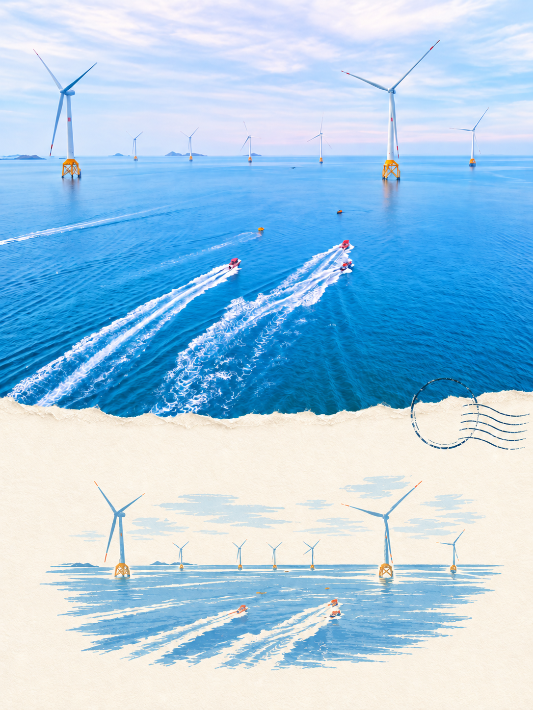
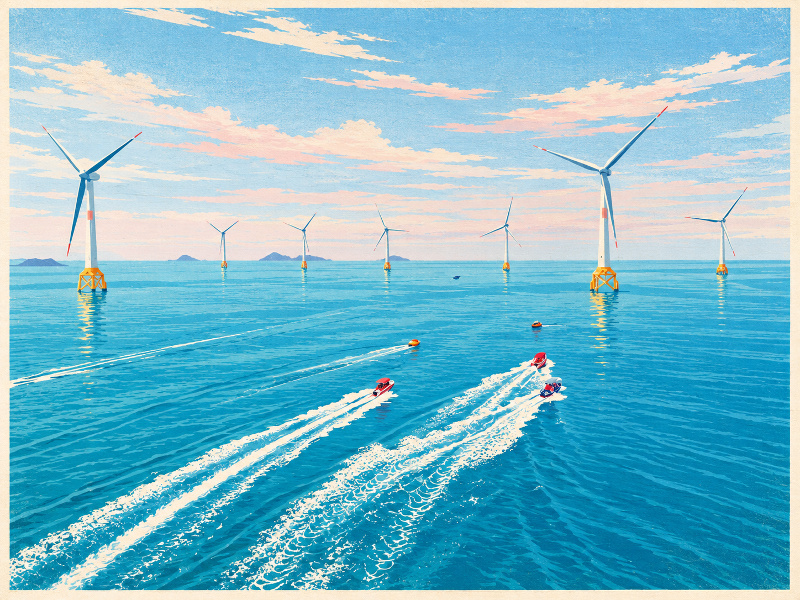
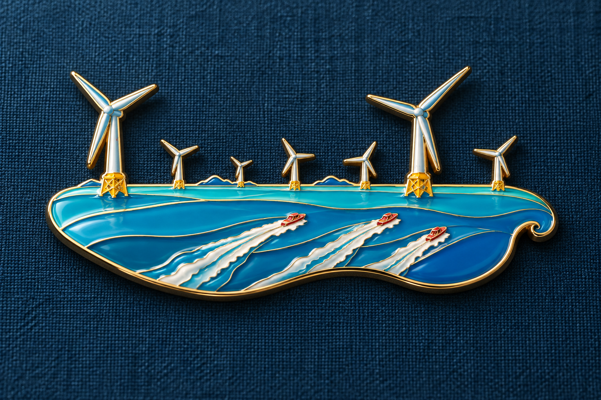

# Travel Photo Keepsakes · 旅行照片纪念品

**一张旅行照片，生成三张可以收藏的纪念图片。**

把照片里的风景和个人记忆，转成撕纸组合明信片、完整插画明信片与金属珐琅冰箱贴效果图。适用于支持 `SKILL.md` 的 AI Agent；已在带内置生图工具的 Codex 环境实际生成样例。

## 三种输出

| 输出 | 设计特点 | 默认比例（宽:高） |
|---|---|---|
| 照片＋插画组合明信片 | 实景与插画明信片上下各 50%、自然撕纸边、克制纸边与邮戳 | 3:4 |
| 独立整幅插画明信片 | 原照转绘为连续完整的复古丝网印刷场景，不拼接原照 | 竖照 3:4 / 横照 4:3 |
| 珐琅冰箱贴效果图 | 提炼主体轮廓、金属包边、珐琅填色、浅浮雕、柔和产品光影 | 3:2 |

整套默认每张原照输出三张独立图片。也可以只选择一种，或要求透明底冰箱贴、原照上下对照展示。具体数量、风格和比例以用户要求为准。

## 组合版布局更新

组合图默认采用 **上半幅实景 50%＋下半幅插画明信片 50%**。1:1 指上下分区等高，整张图仍是竖版 3:4。插画占下半幅可用高度约 75–85%；原照不适配半幅时在其内部等比缩放留边，保护重要主体。

此规则于 2026-09-26 更新，已完成指令一致性与技能结构检查，尚未重新生成样例验证。

## 生成样例：海上风车

**以下组合明信片是旧版样例，不代表新版 50:50 布局。** 另外两类输出规则不变。

以下三张来自同一张横向旅行照片，由 Codex 内置生图工具分别生成。组合版的小插画曾漏掉一座风机，经过一次针对性修正补齐；这些是实际输出，而非保证每次一次生成即可复现的模板效果。

<table>
  <tr>
    <th>照片＋插画组合明信片</th>
    <th>独立整幅插画明信片</th>
    <th>珐琅冰箱贴效果图</th>
  </tr>
  <tr>
    <td><a href="examples/ocean/ocean-postcard.png"></a></td>
    <td><a href="examples/ocean/ocean-postcard-illustration.png"></a></td>
    <td><a href="examples/ocean/ocean-magnet-product.png"></a></td>
  </tr>
  <tr>
    <td>1086 × 1448 · 3:4</td>
    <td>1448 × 1086 · 4:3</td>
    <td>1536 × 1024 · 3:2</td>
  </tr>
</table>

点击图片查看原尺寸。[查看本次生成提示词](examples/ocean/prompts.md)。仓库仅附生成成品，不包含用户原始照片。

## 能力与边界

- 根据照片实际构图选择横竖方向，保护重要人物、地貌与建筑轮廓。
- 从照片提取颜色，成套统一纸色、金属色与视觉层级。
- 地点、日期没有提供就省略，不把 `PLACE`、`DATE` 印上成品。
- 分别生成、检查主体与文字、核对实际比例、保存图片与提示词。
- 生成图片不保证源照片像素级不变；冰箱贴输出是视觉效果图，不是开模 CAD 或已经验证的生产图纸。

**技能文件本身不提供生图模型、API 密钥或额度。** Agent 必须能够看图，并具有支持参考图的图像生成/编辑工具，才能完成照片转绘。只有文字模型或看图能力时，可以准备设计与提示词，但不能完成图片生成。

## 安装与使用

下面是 macOS/Linux 终端示例。Windows 用户可下载仓库 ZIP，将整个文件夹放进对应 Agent 的技能目录，确保 `SKILL.md` 位于 `travel-photo-keepsakes/` 的第一层，且保留 `references/`。目录已存在时先检查已有修改，不要重复覆盖安装。

### Codex

个人安装：

```bash
mkdir -p ~/.agents/skills
git clone https://github.com/GeminiGuy/travel-photo-keepsakes.git \
  ~/.agents/skills/travel-photo-keepsakes
```

项目安装可将目标路径换成 `.agents/skills/travel-photo-keepsakes`。安装后新开一个会话，附上照片并输入：

```text
使用 $travel-photo-keepsakes，把这张照片做成完整三件套。
保留人物姿态，不添加地点和日期。
```

本仓库的样例在具备内置 `image_gen` 的 Codex 环境生成；是否有该工具取决于当前运行环境。安装技能不会为缺少生图工具的 Codex CLI 自动增加工具。工具不可用时，Agent 应说明缺少什么并输出提示词，不伪称已生成。

安装目录依据：[Codex 官方技能文档](https://learn.chatgpt.com/docs/build-skills)。

### OpenClaw

将技能安装到共享技能目录：

```bash
mkdir -p ~/.openclaw/skills
git clone https://github.com/GeminiGuy/travel-photo-keepsakes.git \
  ~/.openclaw/skills/travel-photo-keepsakes
```

也可以安装到你配置的 `<workspace>/skills/travel-photo-keepsakes`，仅供该工作区使用。新开会话，发送照片：

```text
请使用 travel-photo-keepsakes 技能，把这张照片生成三件套：
照片加插画组合明信片、独立整幅插画明信片、金属珐琅冰箱贴。
使用当前已配置的参考图生图工具，分别保存三张图。
```

需要事先配置支持参考图的生图工具或插件；不同 provider 的参数不同，不能直接照搬 Codex 的 `image_gen` 参数。本仓库未在 OpenClaw 上做实际生图验证，也未发布到 ClawHub，因此这里采用 Git 安装。

安装目录依据：[OpenClaw 官方 Skills 文档](https://docs.openclaw.ai/tools/skills)。

### Claude Code

个人安装：

```bash
mkdir -p ~/.claude/skills
git clone https://github.com/GeminiGuy/travel-photo-keepsakes.git \
  ~/.claude/skills/travel-photo-keepsakes
```

项目安装可使用 `.claude/skills/travel-photo-keepsakes`。提供照片文件并调用：

```text
/travel-photo-keepsakes 把这张照片做成三件套，图片路径为 /path/to/photo.jpg
```

同样需要可用的参考图生图 MCP/工具；读图能力不等于生图能力。此安装方式依据官方技能机制，尚未在 Claude Code 上进行端到端出图验证。

参考：[Claude Code 官方 Skills 文档](https://code.claude.com/docs/en/skills)。

### 其他 AI Agent / 聊天界面

- 支持 Agent Skills 的工具：按照该工具文档，将完整目录放入其技能搜索路径。
- 不支持自动发现技能的 Agent：让它读取 `SKILL.md` 及对应 `references/`，再提供照片，并明确可用的生图工具。
- 普通聊天界面：可上传技能说明、相关参考文件和照片作为当前对话上下文。这不等于永久安装技能，出图仍以该界面的实际工具为准。

跨 Agent 的工具适配规则见 [运行环境说明](references/agent-runtime.md)。

## 常用请求

```text
把这张照片做成三件套，保持原照的地貌和人物姿态。
```

```text
只做独立插画明信片，横版 4:3，丝网印刷质感，不要文字。
```

```text
只做珐琅冰箱贴，金色包边，透明背景，不要原照对照版。
```

```text
把这两张照片各做三张，共六张。统一纸色和金属色，独立插画按原照选横竖版。
```

透明底、精确文字及特定尺寸能否成功取决于所用生图工具；需要实际检查结果。大量照片会产生相应数量的生成调用和费用/额度消耗。

## 文件结构

```text
travel-photo-keepsakes/
├── SKILL.md
├── agents/openai.yaml
├── references/
│   ├── postcard.md
│   ├── postcard-illustration.md
│   ├── magnet.md
│   ├── agent-runtime.md
│   └── design-notes.md
└── examples/ocean/
    ├── ocean-postcard.png
    ├── ocean-postcard-illustration.png
    ├── ocean-magnet-product.png
    └── prompts.md
```

`agents/openai.yaml` 是 Codex 的可选界面元数据，其他 Agent 主要读取 `SKILL.md` 与参考文件。仓库不包含自动安装依赖或自动上传照片的脚本。

## 来源与致谢

视觉启发来自 Astra 的[《适合制作旅行周边的美学skill》](https://www.xiaohongshu.com/explore/6a952d7b00000000070050dd)。原文将明信片提示词归于 **@Vaeen Ai Design**，徽章提示词归于 **@顾翠西**。本项目将相关思路重新组织成照片分析、版式选择、三类生成、检查与交付流程，并增加独立整幅插画模式。

来源分析依据用户提供的截图和正文，不宣称已核验全部九张原始示例，也不宣称相关视觉风格独家原创。具体推导见 [设计说明](references/design-notes.md)。展示图片为 AI 生成案例；仓库公开展示不代表对第三方素材作额外授权。
